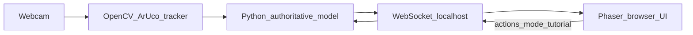

# Old Mick and the Emus — Final Report

**Project:** Hybrid Vision-Based AR Board Game  
**Product:** Old Mick and the Emus  
**Format:** ~10 pages A4 equivalent | 11pt Times New Roman (recommended when exporting to Word/PDF)

---

## 1. Introduction

**Old Mick and the Emus** is a hybrid augmented-reality board game that combines a physical tabletop with a live digital model of the game state. Players sit opposite each other, move printed token pieces on a gridded board, and interact with the rules engine through a camera that watches the table. The digital layer—delivered in the browser—shows territory, attack rays, scores, tutorials, and feedback while the social experience remains face-to-face.

The game is an asymmetric two-player contest inspired by the Australian “Emu War” theme: **Old Mick** (Player 1) defends farmland on one side of the board; **the Mob** (Player 2) attacks from the other. A procedural map randomises terrain placement; a **hidden HQ** mechanism forces players to commit to secret base locations before battle. The prototype is player-versus-player (PVP) only—there is no single-player “optimal” opponent to grind against.

*[Figure 1: Physical setup—printed board, 3D-printed tokens with character art, webcam overhead, laptop showing the Phaser UI. Insert team photo here.]*

### 1.1 What problem it solves

The prototype targets two related problems.

**Onboarding and rules literacy.** Traditional board games are often learned by reading a dense rulebook alone or by depending on an experienced player to teach. The first path intimidates new players; the second depends on teacher skill and availability. Our response is a **tutorial mode** that uses animated GIFs, reference images, and short on-screen copy, and that asks the player to perform real actions (scanning markers, placing tokens) while learning—not only reading static rules.

**Social play versus screen isolation.** Many digital games are played alone in front of a screen. Our design keeps players at the same table: the screen supports rules and feedback; the primary interaction is physical. PVP, hidden HQ, and map randomisation encourage negotiation and adaptation to a human opponent rather than memorising a computer strategy.

### 1.2 Why the product is important and innovative

The product sits at the intersection of **board games**, **computer vision**, and **local multiplayer**. It is innovative for this project scope in three ways:

1. **Vision-driven rules** — Piece positions and facings come from ArUco markers detected in real time, not from manual entry in a companion app.
2. **Authoritative digital rules** — Python holds the single source of truth for board state; the UI renders that state and sends explicit player actions (mode select, tutorial advance, end turn via markers).
3. **Deliberate physical+digital pacing** — Turn and confirm markers gate when the tracker may apply moves, so continuous vision does not accidentally end a turn mid-planning.

*[Figure 2: System architecture. Insert diagram: Webcam → OpenCV/ArUco tracker → Python rules → WebSocket (localhost) → Phaser UI; UI actions flow back through WebSocket to Python. A mermaid source is included in Appendix B.]*

---

## 2. Implementation Justification

This section explains how the prototype meets the project brief, how we designed and built it, and why key decisions were made.

### 2.1 Mapping to project brief requirements

The brief (*Hybrid Vision-Based AR Board Game*) requires:

| Brief requirement | How the prototype addresses it |
|-------------------|--------------------------------|
| Maintain an accurate digital model of board state | `model_backend` holds authoritative game state; each camera tick updates token poses and applies rules; the UI receives a full snapshot over WebSocket (~10 Hz). |
| Robust real-time object tracking | `python_tracker` detects ArUco markers on corners, tokens, turn markers, confirm marker, HQ, and nuke; homography maps image coordinates to grid cells. |
| Spatial relationships (adjacency, territory, grouping) | 12×12 grid; diagonal territory split (column+row fence); attack rays, defense zones, terrain, and HQ/nuke placement respect side ownership. |
| Tangible social tabletop + digital rules without breaking immersion | Physical tokens and board; screen used for state, tutorial, and effects; turn/confirm markers reduce spurious digital reactions. |
| Rule-based events from spatial configuration | Attacks, terrain destruction, upgrades, and nuke triggers derive from token positions and facings encoded in the model. |

Contract documentation: `docs/board_state_v1.md`, `docs/authoritative_actions_v1.md`, `docs/old_mick_mvp_rules.md`.

### 2.2 Design process

Development followed a cycle of learning and narrowing scope.

**Pitch stage.** The team started with a vague “AR board game” idea without fixed technology choices.

**Gameplay prototypes (Pygame ×2).** We built two local prototypes under `prototype_pygame/` using mouse and keyboard. These validated win conditions, pacing, and core interactions **without** a camera. They were essential for game feel but hid a major integration risk: continuous state updates from vision.

**Backend and vision spike.** We studied OpenCV and ArUco marker pipelines, including an open-source reference that uses corner markers to locate the board ([yunus-temurlenk, Augmented Reality Projects with Aruco Markers](https://github.com/yunus-temurlenk/Augmented-Reality-Projects-with-Aruco-Markers)). Early logic was also explored in C++ (`docs/Reference/main.cpp`, preserved as history only—see `docs/cpp_reference.md`). The production tracker is **Python**: `python_tracker/` for capture, detection, calibration, and snapshot output.

**Frontend path.** We briefly experimented with **React** (`react_frontend/`) but lacked team experience for timely delivery. The **shipped demo UI** uses **Phaser 3** (`yu_pat_test4/frontend/` and related assets): HTML/CSS side panels plus a canvas board scene, tutorial overlays with GIF and image panels, and WebSocket client code under `protocol/websocket/browser_client.js` (shared pattern).

**Integration.** `runner/run_live_tracker.py` runs the full loop: camera → tracker → model → WebSocket broadcast. HTTP serves static frontend files on port 8080; WebSocket uses port 8765 by default. Python is authoritative; the tracker proposes moves; the model validates and commits state.

### 2.3 Technical architecture (summary)

1. **Camera** captures frames (OpenCV).
2. **Tracker** detects markers and builds a snapshot (grid positions, facings, board calibration).
3. **Model / session logic** merges marker data with game rules, setup phases, battle flow, and tutorial controller state.
4. **Bridge** (`bridge/transport/websocket_transport.py`) broadcasts JSON state to all browsers and queues inbound actions.
5. **Phaser UI** renders board, panels, tutorial; sends actions such as `select_mode`, `tutorial_dismiss`, and relies on physical markers for most battle moves.

OpenCV and ArUco run on the **Python backend**, not in the browser. The frontend only receives already-computed state.

### 2.4 Key design decisions

**Turn marker and confirm marker.** The tracker runs continuously. In early integration, any token movement could be interpreted as completing a turn—unlike our Pygame prototype where turns were discrete clicks. We introduced an explicit **turn marker** (scan to claim the active side) and a **confirm marker** (scan to lock moves and resolve attacks). This matches how players plan multiple moves before committing.

**3D-printed marker blind (class playtest fix).** The original turn marker was a cube: the top-down camera could see **both** the turn marker and the confirm marker at once, causing incorrect state transitions. We added a 3D-printed slider/blind so only one marker is presented to the camera at a time.

**Printed token art and gridded board.** Raw ArUco markers are poor visual affordances for humans (see competitor discussion). We 3D-printed tokens with character images and produced a board with visible grid and terrain art so players do not need to stare at the screen to find cell coordinates.

**Tutorial media and typography.** Classroom testing showed tutorial text was too small at viewing distance and hard to parse quickly. We increased font sizes, added **GIF** steps (e.g. scanning corners, turn markers), and **with_pic** steps with still images (HQ placement, nuke explanation, quick guide). Tutorial steps are data-driven in the live rules module.

**Token detection reliability.** Markers failed when printed too large or without enough white border. We reduced token footprint and enforced whitespace around each ArUco code. Recognition became stable enough that play felt “seamless” in later sessions.

### 2.5 Technology problems encountered

| Problem | Cause | Response | Outcome |
|---------|--------|----------|---------|
| Turn ends unexpectedly | Continuous tracking vs discrete Pygame turns | Turn + confirm marker protocol | Players can plan multiple moves per turn |
| Both markers visible | Cube turn marker + top-down camera | 3D-printed blind, one marker exposed | Reliable confirm flow |
| Tutorial unreadable | Small overlay text | Larger fonts, GIFs, pictures | Better class demos |
| Token jitter / loss | Marker size and contrast | Smaller tokens, white margin | Improved detection |
| Screen-only navigation | Plain board, no grid art | Printed grid and token graphics | Stronger immersion |

---

## 3. Competitor Analysis

We position **Old Mick and the Emus** against **vision-based tabletop AR** research and adjacent product categories—not against general digital tabletop simulators such as Tabletop Simulator, which solve a different problem (remote/digital-only play).

### 3.1 Vision-based tabletop AR (primary reference)

Molla et al. describe a mosaic-based tabletop AR approach where the physical pieces are designed as visual mosaics for robust tracking ([Molla et al., ISMAR 2010](https://www.tugraz.at/fileadmin/user_upload/Institute/ICG/Images/team_lepetit/publications/molla_ismar10.pdf)). That design assumes tiles are **made for recognition**. Our game uses a **custom narrative skin** (farmers vs emus) on standard marker technology; players cannot rely on mosaic appearance alone. We therefore added **human-readable graphics** on tokens and board while keeping ArUco IDs for the engine.

**Implication:** Our innovation is not “marker tracking alone” but **pairing** reliable vision with **table-specific industrial design** (grid, art, marker blind, tutorial media) so AR serves a themed social game.

### 3.2 App-assisted board games (non-AR)

Many commercial titles use companion apps for setup, scoring, or timers while players move pieces manually—but often require **manual state entry** or button taps per action. Our prototype reduces that friction by inferring piece pose from the camera, at the cost of camera setup and lighting constraints.

### 3.3 Pure online board platforms

Platforms that replicate boards digitally excel at remote play but remove in-person interaction. Old Mick explicitly optimises for **co-located PVP** and uses digital output to **support** the physical layer rather than replace it.

### 3.4 Design choices justified by competition

We did **not** reuse Monopoly-scale generic miniatures: they are not designed for top-down ArUco discrimination at prototype scale. We chose **local processing** (laptop + webcam) for demo and privacy simplicity rather than cloud streaming or mobile AR platforms that would expand scope beyond the brief.

---

## 4. Security and Data Privacy Considerations

The prototype is intentionally **local-first** and **minimal-data**.

**Processing locality.** Camera frames are processed on the machine running `runner/run_live_tracker.py`. We do not send video to a cloud API for inference in the prototype. Game state is broadcast over **WebSocket to localhost** (default `ws://localhost:8765`), not to third-party servers.

**Personal information.** The game does not require accounts, names, or contact details. Under the *Privacy Act 1988* (Cth), Australian Privacy Principles are largely **not engaged** when no personal information is collected; we still adopted **data minimisation** as a design principle: only game telemetry needed for rules is derived from the board.

**Public repository.** Source code and assets are published on GitHub. That exposes implementation details and art assets, not player data. AI-generated art provenance is discussed under ethics.

**Residual risks.**

- A classroom camera may inadvertently capture bystanders if angled too wide—mitigated by framing the board only and consenting participants in tests.
- Local WebSocket has no encryption in the prototype; acceptable on loopback for demo, not for production over untrusted networks.
- Markers and map seeds are visible in open source; competitive secrecy in a commercial product would need stronger anti-cheat design.

We do not claim “security is irrelevant”; we claim controls are **proportionate** to a local university prototype.

---

## 5. Ethical Considerations

### 5.1 Generative AI artwork

Limited art resources led the team to use **AI-generated images** for tokens, terrain, and UI elements. We mitigated concerns by:

- Using an original theme rather than copying branded characters.
- Reviewing assets for obvious defects before printing.
- Documenting AI use in this report for transparency.

**Trade-off:** speed and consistency versus the authenticity of handmade art—a acceptable compromise for a time-boxed prototype.

### 5.2 Camera use and consent

Playtests in class involved volunteers who understood they were being filmed for project evaluation. Frames are processed locally; we did not build a retention pipeline for raw video. Participants should not be identifiable in marketing materials without consent.

### 5.3 Accessibility and fair play

**Accessibility:** Tutorial text size, GIFs, and pictorial steps were improved after feedback that rules were hard to read from a distance. Physical token labels reduce dependence on reading ArUco IDs.

**Fair play:** Hidden HQ and simultaneous planning rely on honour rules (opponent looks away during placement)—stated in tutorial copy—mirroring physical board game norms.

---

## 6. Evaluation Approach

### 6.1 What counts as success

Success was judged against the project brief and playability goals:

| Criterion | How we measured | Result |
|-----------|-----------------|--------|
| Accurate board state | Compare physical cell to on-screen grid after moves | Good after token redesign |
| Real-time tracking | Continuous updates without manual refresh; ~10 Hz target | Achieved after turn/confirm gating |
| Immersion | Players reference board first, screen for confirmation | Improved with grid/art tokens |
| Tutorial effectiveness | New player can complete tutorial flow in session | Improved with GIF/picture steps |
| Robustness | No false turn end; no dual-marker confusion | Fixed with confirm workflow and marker blind |

### 6.2 Methods

We ran **four structured play sessions**:

- **Two in-class test sessions** with peers (formative usability and hardware feedback).
- **Two internal team playtests** (integration and regression before demos).

Debugging also used `runner/run_camera_preview.py` and `runner/run_marker_preview.py` to isolate vision without full UI.

We did not run a large quantitative user study; findings are **qualitative** but grounded in repeated observation across sessions.

### 6.3 Findings and mitigations

| Issue observed | Interpretation | Change made |
|----------------|----------------|-------------|
| Turn ended when moving one piece | Model treated each detection change as commit | Turn marker + confirm marker |
| Confirm triggered while turn marker visible | Top-down view of cube | 3D-printed blind exposing one marker |
| Tutorial text too small | UI scale and viewing distance | Larger fonts; GIF and image panels |
| Tokens not detected | Marker contrast and size | Smaller markers; mandatory white border |
| Players watched screen for coordinates | Board lacked grid | Printed grid and terrain art |

After these changes, internal testers described tracking as **seamless** relative to early builds: moves registered when intended, and the digital layer stayed aligned with the physical layout.

### 6.4 Reflection and learning

**Technical learning:** Real-time vision changes the game design contract. Discrete-turn assumptions from Pygame do not transfer unless the engine defines explicit **gating** (whose turn, when commits happen). Marker-driven UX is part of the rules, not an afterthought.

**Physical UX learning:** AR board games are half software and half **industrial design**. Recognition accuracy and player immersion depend on whitespace, token graphics, board print quality, and camera placement as much as on detection algorithms.

**Process learning:** Early React exploration consumed time; committing to **Phaser** matched team skills and still supported rich tutorial media (including DOM overlays for animated GIFs). Maintaining a single authoritative Python model avoided split-brain state between UI and tracker.

---

## 7. Conclusion

**Old Mick and the Emus** demonstrates a viable hybrid AR board game loop: physical PVP on a printed board, continuous marker tracking, authoritative digital rules, and a Phaser front end for feedback and onboarding. The prototype meets the brief’s core requirements—accurate board state, real-time tracking, spatial rule enforcement, and digital events driven by configuration—while playtesting drove concrete improvements (turn/confirm protocol, marker blind, art, tutorial media, token printing).

Future work could add encrypted transport, richer analytics, anti-cheat, and non-AI art pipelines; those were out of scope for this prototype.

---

## Appendix A — Project brief (requirements)

**Title:** Hybrid Vision-Based AR Board Game

**Requirements:**

1. Maintain an accurate digital model of board state.
2. Deliver a robust, real-time object tracking system that reliably identifies markers on various components and accurately responds to spatial relationships (adjacency, grouping, territory) among them.
3. Seamlessly blend the tangible, social nature of a tabletop experience with a digital rules engine that updates states, triggers events, and manages progression without breaking immersion.
4. Trigger rule-based or adaptive digital events based on spatial configuration.

---

## Appendix B — System architecture (diagram source)

Use this diagram for Figure 2 when exporting to Word/PDF:

**Repository modules (implementation reference):**

| Layer | Folder / entry |
|-------|----------------|
| Vision | `python_tracker/` |
| Rules | `model_backend/` |
| Transport | `bridge/transport/websocket_transport.py` |
| Live runner | `runner/run_live_tracker.py` |
| Phaser UI | `yu_pat_test4/frontend/` (delivered demo) |
| Pygame prototypes | `prototype_pygame/` |
| React experiment (not shipped) | `react_frontend/` |

---

## Appendix C — Glossary

| Term | Meaning |
|------|---------|
| ArUco | Dictionary-based fiducial markers detected by OpenCV for pose and ID. |
| Homography | Plane-to-plane mapping from camera image to board coordinates after corner calibration. |
| Authoritative state | Single source of truth in Python; UI does not invent rules outcomes. |
| WebSocket | Full-duplex channel; browser receives state snapshots and sends actions. |
| Turn / confirm markers | Physical markers scanned to gate whose turn it is and when moves commit. |

---

## References

Molla, E, Lemaignan, S, Brandao, M, Lieberknecht, S, Magnenat, S, Gerndt, D, & Caldwell, D G 2010, ‘MOSAIC: A scalable interactive space for large groups of interactive tabletop interfaces’, *Proceedings of ISMAR 2010*, Graz University of Technology. Available at: https://www.tugraz.at/fileadmin/user_upload/Institute/ICG/Images/team_lepetit/publications/molla_ismar10.pdf

OpenCV Team, *OpenCV Library*, https://opencv.org/

Garrido-Jurado, S et al., ‘Automatic generation and detection of highly reliable fiducial markers under occlusion’, *Pattern Recognition*, vol. 47, no. 6, 2014, pp. 2280–2292. (ArUco marker dictionary used in practice.)

Phaser Studio, *Phaser 3*, https://phaser.io/

yunus-temurlenk, *Augmented-Reality-Projects-with-Aruco-Markers*, GitHub repository, https://github.com/yunus-temurlenk/Augmented-Reality-Projects-with-Aruco-Markers

Australian Government, *Privacy Act 1988* (Cth), Office of the Australian Information Commissioner overview of Australian Privacy Principles, https://www.oaic.gov.au/

---

## Figures checklist (insert when exporting)

| Figure | Caption | Source |
|--------|---------|--------|
| Figure 1 | Physical game setup (board, tokens, camera, laptop) | Team photo |
| Figure 2 | End-to-end system architecture | Appendix B mermaid → export PNG |
| Figure 3 | Marker set (corner, turn, confirm, token IDs) | `markers/` or photo |
| Figure 4 | Tutorial overlay with GIF or picture panel | Screenshot from Phaser tutorial step |
| Figure 5 | Marker blind / token whitespace before–after | Team photo comparison |
